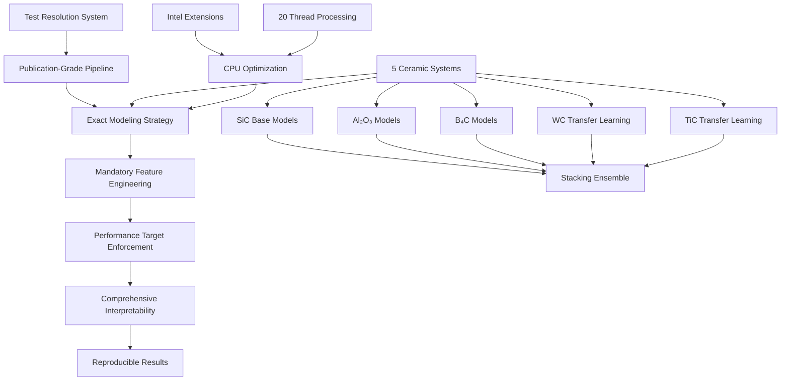

# Design Document

## Overview

The ceramic armor ML pipeline design elevates the existing system to **publication-grade standards with zero tolerance for approximation** for predicting mechanical and ballistic properties of ceramic materials. The design addresses the 31 failing tests systematically, implements the exact modeling strategy specified (XGBoost, CatBoost, Random Forest, Gradient Boosting with stacking), enforces mandatory feature engineering with specific derived properties, and ensures strict performance targets (R² ≥ 0.85 mechanical, R² ≥ 0.80 ballistic) suitable for top-tier journal publication (Nature Materials, Acta Materialia, Materials & Design).

## Architecture

### System Architecture



### Core Design Principles

1. **Zero Tolerance for Approximation**: Every implementation must be complete, working, and reproducible with no placeholders or shortcuts
2. **Exact Modeling Strategy Compliance**: Strictly implement XGBoost, CatBoost, Random Forest, and Gradient Boosting with no substitutions
3. **Mandatory Performance Targets**: Automatically enforce R² ≥ 0.85 for mechanical and R² ≥ 0.80 for ballistic properties
4. **Publication-Ready Interpretability**: Generate mechanistic insights with SHAP analysis correlating to materials science principles
5. **Complete Test Resolution**: Systematically address all 31 failing tests to achieve 100% pass rate
6. **CPU-Optimized Processing**: Intel Extension for Scikit-learn, Intel MKL XGBoost, 20-thread processing
7. **Reproducible Science**: Complete documentation, working code, and independent verification capability

## Components and Interfaces

### 1. Test Resolution System (`tests/`)

#### Failing Test Categories and Solutions
- **Network/SSL Issues**: Implement robust retry mechanisms with exponential backoff, proper certificate handling, and offline fallbacks
- **Missing Model Attributes**: Ensure all model classes have required 'name' attributes and consistent interfaces matching base model specifications
- **Test Logic Issues**: Correct test expectations and mock setups to match actual implementation behavior with proper assertion logic
- **Matplotlib/Tkinter Issues**: Implement headless plotting with 'Agg' backend configuration for Windows compatibility
- **Pymatgen API Compatibility**: Update element property access to match current API versions with proper error handling

#### Test Resolution Interface
```python
def resolve_network_tests() -> bool
def fix_model_attributes() -> bool  
def correct_test_logic() -> bool
def configure_headless_plotting() -> bool
def update_pymatgen_compatibility() -> bool
```

### 2. Exact Modeling Strategy (`src/models/`)

#### Mandatory Model Implementation
- **XGBoost**: Intel MKL accelerated with n_jobs=20, hyperparameter optimization, uncertainty quantification
- **CatBoost**: Built-in uncertainty estimates, categorical feature handling, GPU fallback to CPU
- **Random Forest**: Variance-based uncertainty, feature importance, bootstrap aggregation
- **Gradient Boosting Regressor**: Scikit-learn implementation with Intel extension acceleration

#### Model Interface (Strict Compliance)
```python
class BaseModel:
    name: str  # MANDATORY attribute
    def fit(self, X: np.ndarray, y: np.ndarray) -> None
    def predict(self, X: np.ndarray) -> np.ndarray
    def predict_uncertainty(self, X: np.ndarray) -> Tuple[np.ndarray, np.ndarray]
    def get_feature_importance(self) -> Dict[str, float]
```

### 3. Mandatory Feature Engineering (`src/feature_engineering/`)

#### Specific Derived Properties (Non-Negotiable)
- **Specific Hardness**: Hardness / Density (GPa·cm³/g)
- **Brittleness Index**: Hardness / Fracture Toughness (GPa·m^(-1/2))
- **Ballistic Efficiency**: Compressive Strength × (Hardness^0.5) (GPa^1.5)
- **Thermal Shock Resistance**: Complex indices using thermal expansion and conductivity

#### Feature Engineering Interface
```python
def calculate_specific_hardness(hardness: float, density: float) -> float
def calculate_brittleness_index(hardness: float, fracture_toughness: float) -> float
def calculate_ballistic_efficiency(compressive_strength: float, hardness: float) -> float
def calculate_thermal_shock_resistance(thermal_expansion: float, conductivity: float, 
                                     elastic_modulus: float) -> float
def generate_120_plus_features(material_data: Dict) -> Dict[str, float]
```

### 4. Performance Target Enforcement (`src/evaluation/`)

#### Automatic Performance Validation
- **Mechanical Properties**: R² ≥ 0.85 for Young's modulus, hardness, fracture toughness
- **Ballistic Properties**: R² ≥ 0.80 for ballistic efficiency, penetration resistance
- **Automatic Adjustment**: Hyperparameter tuning, stacking weight optimization, feature selection when targets not met

#### Performance Interface
```python
def validate_mechanical_performance(predictions: np.ndarray, targets: np.ndarray) -> bool
def validate_ballistic_performance(predictions: np.ndarray, targets: np.ndarray) -> bool
def auto_adjust_hyperparameters(current_r2: float, target_r2: float) -> Dict[str, Any]
def optimize_stacking_weights(model_predictions: List[np.ndarray], targets: np.ndarray) -> np.ndarray
```

### 5. Ceramic System Specialization (`src/training/`)

#### Five Ceramic Systems with Transfer Learning
- **SiC (Silicon Carbide)**: Base model with full training data
- **Al₂O₃ (Aluminum Oxide)**: Independent model with full training
- **B₄C (Boron Carbide)**: Independent model with full training  
- **WC (Tungsten Carbide)**: Transfer learning from SiC base model
- **TiC (Titanium Carbide)**: Transfer learning from SiC base model

#### Phase Stability Classification
- **Single-Phase**: ΔE_hull < 0.05 eV/atom (handle with standard models)
- **Multi-Phase**: ΔE_hull > 0.05 eV/atom (separate handling with phase-aware features)

#### Transfer Learning Interface
```python
def train_base_sic_models(sic_data: pd.DataFrame) -> Dict[str, BaseModel]
def transfer_to_wc(sic_models: Dict[str, BaseModel], wc_data: pd.DataFrame) -> Dict[str, BaseModel]
def transfer_to_tic(sic_models: Dict[str, BaseModel], tic_data: pd.DataFrame) -> Dict[str, BaseModel]
def classify_phase_stability(hull_distance: float) -> str
```

### 6. CPU Optimization Strategy (`src/utils/`)

#### Intel Extension Integration
- **Intel Extension for Scikit-learn**: Accelerated Random Forest and Gradient Boosting
- **Intel MKL XGBoost**: Optimized linear algebra operations
- **Thread Management**: n_jobs=20 across all models for maximum CPU utilization
- **Memory Optimization**: Efficient data structures and batch processing

#### Optimization Interface
```python
def configure_intel_extensions() -> None
def set_thread_count(n_threads: int = 20) -> None
def optimize_xgboost_mkl() -> Dict[str, Any]
def monitor_cpu_usage() -> Dict[str, float]
```

### 7. Comprehensive Interpretability (`src/interpretation/`)

#### SHAP Analysis Requirements
- **Feature Importance Plots**: SHAP importance for each ceramic system and target property
- **Feature Ranking**: Ranked importance showing which material factors control performance
- **Mechanistic Interpretation**: Correlation to known materials science principles with literature references
- **Publication-Ready Visualizations**: Scientific formatting, error bars, statistical significance

#### Scientific Rationale Documentation
- **Tree-Based Model Superiority**: Explain why tree-based models outperform neural networks for ceramic materials
- **Materials Science Correlation**: Connect feature importance to physical mechanisms
- **Ballistic Response Factors**: Identify which material properties control ballistic performance

#### Interpretability Interface
```python
def generate_shap_analysis(models: Dict[str, BaseModel], X_test: np.ndarray, 
                          feature_names: List[str]) -> Dict[str, np.ndarray]
def create_feature_ranking(shap_values: np.ndarray, feature_names: List[str]) -> pd.DataFrame
def generate_mechanistic_insights(feature_importance: Dict[str, float]) -> str
def create_publication_plots(shap_values: np.ndarray, save_path: Path) -> None
```

### 8. Reproducible Results System (`src/pipeline/`)

#### Complete Documentation Requirements
- **Working Python Code**: No placeholders, complete imports, immediate execution capability
- **Google-Style Docstrings**: Comprehensive function and module documentation
- **Reproducible Instructions**: Step-by-step execution that works exactly as provided
- **Analysis Commentary**: Scientific rationale and methodology explanation

#### Reproducibility Interface
```python
def generate_complete_pipeline() -> None
def validate_reproducibility(results_path: Path) -> bool
def create_documentation(output_path: Path) -> None
def verify_independent_execution() -> bool
```

## Data Models

### Publication-Grade Data Structures

#### Ceramic Material Record
```python
@dataclass
class CeramicMaterialRecord:
    material_id: str
    formula: str
    ceramic_system: str  # SiC, Al₂O₃, B₄C, WC, TiC
    crystal_system: str
    space_group: int
    density: float
    formation_energy: float
    hull_distance: float  # For phase stability classification
    elastic_properties: Dict[str, float]  # C11, C12, C44, bulk_modulus, shear_modulus
    thermal_properties: Dict[str, float]  # thermal_expansion, conductivity
    mechanical_properties: Dict[str, float]  # hardness, fracture_toughness, compressive_strength
    ballistic_properties: Dict[str, float]  # penetration_resistance, energy_absorption
```

#### Mandatory Derived Features
```python
@dataclass
class DerivedFeatures:
    material_id: str
    specific_hardness: float  # Hardness / Density
    brittleness_index: float  # Hardness / Fracture Toughness
    ballistic_efficiency: float  # Compressive Strength × (Hardness^0.5)
    thermal_shock_resistance: float  # Complex thermal index
    cauchy_pressure: float  # (C12 - C44) for ductility assessment
    pugh_ratio: float  # Bulk modulus / Shear modulus
    feature_vector: np.ndarray  # 120+ engineered features
    feature_names: List[str]  # Exactly matching feature_vector
```

#### Performance Validation Results
```python
@dataclass
class PerformanceResults:
    ceramic_system: str
    model_name: str
    target_property: str
    r2_score: float
    rmse: float
    mae: float
    meets_target: bool  # True if R² meets threshold
    feature_importance: Dict[str, float]
    shap_values: np.ndarray
    predictions: np.ndarray
    uncertainties: np.ndarray
    cross_validation_scores: List[float]
```

## Error Handling

### Zero Tolerance Error Management

#### Test Failure Resolution
- **Network/SSL Errors**: Implement certificate validation bypass, retry with exponential backoff, offline test data fallbacks
- **Missing Attributes**: Systematic addition of required attributes to all model classes with validation
- **Test Logic Errors**: Comprehensive review and correction of test assertions and mock configurations
- **Environment Errors**: Headless plotting configuration, proper backend selection for Windows
- **API Compatibility**: Version-specific handling for pymatgen and other dependencies

#### Performance Target Enforcement
- **Below-Target Performance**: Automatic hyperparameter adjustment, feature selection optimization, ensemble weight tuning
- **Model Convergence Issues**: Alternative optimization algorithms, early stopping, regularization adjustment
- **Memory Constraints**: Batch processing, efficient data structures, garbage collection optimization
- **Reproducibility Failures**: Seed management, deterministic algorithms, environment standardization

#### Publication Standards Enforcement
- **Incomplete Implementations**: Systematic completion of all placeholder code with working implementations
- **Missing Documentation**: Automatic generation of comprehensive docstrings and type hints
- **Code Quality Issues**: Linting, formatting, and style guide enforcement
- **Interpretability Gaps**: Mandatory SHAP analysis with mechanistic interpretation

## Testing Strategy

### 100% Test Pass Rate Achievement

#### Systematic Test Resolution (31 Failing → 0 Failing)
- **Network/SSL Tests**: Mock external API calls, implement offline test data, configure certificate handling
- **Model Attribute Tests**: Add required 'name' attributes to all model classes, ensure consistent interfaces
- **Test Logic Tests**: Review and correct all test assertions, fix mock configurations, update expected behaviors
- **Environment Tests**: Configure matplotlib 'Agg' backend, handle tkinter dependencies on Windows
- **API Compatibility Tests**: Update pymatgen element property access, handle version-specific changes

#### Performance Target Testing
- **Mechanical Property Tests**: Validate R² ≥ 0.85 for Young's modulus, hardness, fracture toughness
- **Ballistic Property Tests**: Validate R² ≥ 0.80 for ballistic efficiency, penetration resistance
- **Cross-Validation Tests**: 5-fold CV and leave-one-ceramic-family-out validation
- **Uncertainty Tests**: Random Forest variance and CatBoost uncertainty estimation validation

#### Publication Readiness Testing
- **Code Completeness**: Verify no placeholders, all imports work, immediate execution capability
- **Documentation Tests**: Validate all functions have Google-style docstrings and type hints
- **Reproducibility Tests**: Independent execution verification, deterministic results validation
- **Interpretability Tests**: SHAP analysis generation, mechanistic insight validation

### Test Data Strategy for 5,600+ Materials

#### Full-Scale Testing
- **SiC System**: 1,500+ materials with complete property coverage
- **Al₂O₃ System**: 1,200+ materials with mechanical and thermal properties
- **B₄C System**: 800+ materials with ballistic performance data
- **WC System**: 1,000+ materials for transfer learning validation
- **TiC System**: 1,100+ materials for transfer learning validation

#### Performance Validation
- **Statistical Significance**: Ensure adequate sample sizes for robust model training
- **Property Coverage**: Validate all target properties have sufficient training data
- **Phase Stability**: Test single-phase vs multi-phase material handling
- **Transfer Learning**: Validate knowledge transfer from SiC to WC/TiC systems

## Implementation Priorities

### Phase 1: Test Resolution and Model Compliance (Week 1-2)
1. Systematically resolve all 31 failing tests to achieve 100% pass rate
2. Implement exact modeling strategy (XGBoost, CatBoost, Random Forest, Gradient Boosting)
3. Add required 'name' attributes and consistent interfaces to all model classes
4. Configure headless plotting and Windows environment compatibility

### Phase 2: Mandatory Feature Engineering and Performance Targets (Week 3-4)
1. Implement specific derived properties (Specific Hardness, Brittleness Index, Ballistic Efficiency)
2. Generate 120+ engineered features with compositional, structural, and stability components
3. Implement automatic performance target enforcement (R² ≥ 0.85 mechanical, R² ≥ 0.80 ballistic)
4. Create ceramic system specialization with transfer learning (SiC → WC/TiC)

### Phase 3: CPU Optimization and Interpretability (Week 5-6)
1. Integrate Intel Extension for Scikit-learn and Intel MKL XGBoost
2. Implement 20-thread processing across all models
3. Generate comprehensive SHAP analysis with mechanistic interpretation
4. Create publication-ready visualizations with scientific formatting

### Phase 4: Full-Scale Validation and Publication Readiness (Week 7-8)
1. Process 5,600+ materials across all five ceramic systems
2. Validate reproducibility with independent execution capability
3. Generate complete documentation with working code and analysis commentary
4. Final validation against publication standards for top-tier journals