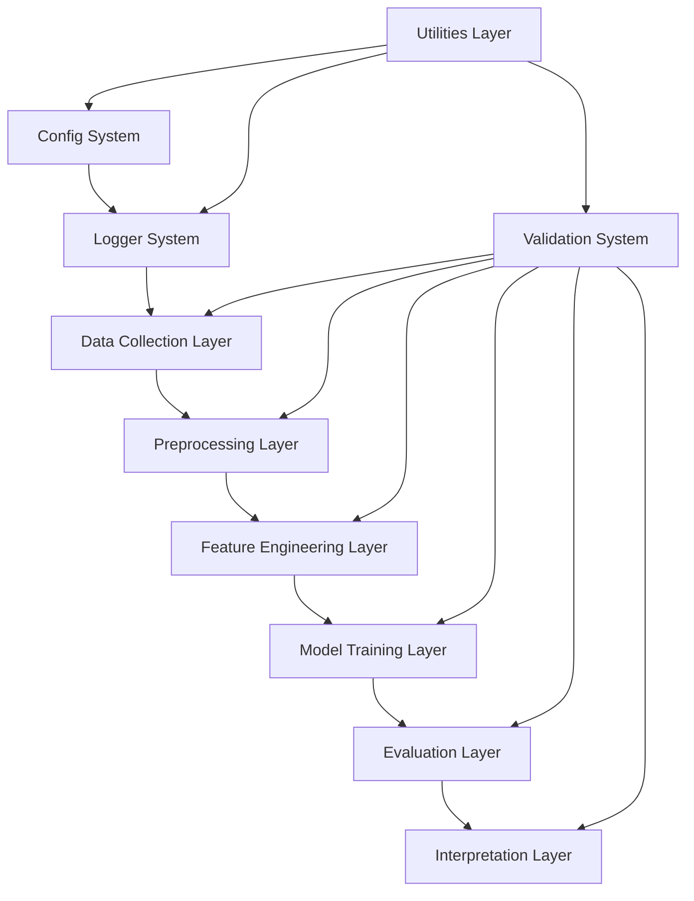

# Design Document

## Overview

The ceramic armor ML pipeline design addresses critical gaps in the existing codebase by **completing missing implementations and fixing integration issues** in the current robust system for predicting mechanical and ballistic properties of ceramic materials. The existing architecture already provides most components, but requires specific fixes for import errors, missing implementations, and data handling inconsistencies while maintaining publication standards for top-tier materials science journals.

## Architecture

### System Architecture



### Core Design Principles

1. **Fail-Safe Operations**: Every component handles errors gracefully with comprehensive logging
2. **Windows Compatibility**: All file operations use pathlib and Windows-specific configurations
3. **Incremental Processing**: Save intermediate results to enable crash recovery
4. **Consistent Data Schemas**: Standardized data formats across all pipeline stages
5. **Production Readiness**: Type hints, docstrings, and comprehensive error handling

## Components and Interfaces

### 1. Utilities Layer (`src/utils/`)

#### Logger System (`logger.py`)
- **Purpose**: Centralized logging with file rotation and structured output
- **Key Features**:
  - Dual output (console + file) with different log levels
  - Automatic file rotation (10MB limit, 5 backup files)
  - Windows-compatible file paths using pathlib
  - Structured logging with timestamps and module identification
- **Interface**:
  ```python
  def get_logger(name: str, level: str = "INFO") -> logging.Logger
  def setup_file_handler(log_dir: Path) -> logging.FileHandler
  ```

#### Configuration Loader (`config_loader.py`)
- **Purpose**: Robust YAML configuration management with validation
- **Key Features**:
  - Hierarchical config loading (config.yaml + model_params.yaml)
  - Environment variable substitution
  - Default value fallbacks for missing keys
  - Type validation and schema checking
- **Interface**:
  ```python
  def load_config(config_path: Path) -> Dict[str, Any]
  def validate_config(config: Dict[str, Any]) -> bool
  def merge_configs(*configs: Dict[str, Any]) -> Dict[str, Any]
  ```

#### Data Utilities (`data_utils.py`)
- **Purpose**: Common data handling operations with error resilience
- **Key Features**:
  - Safe file I/O with automatic directory creation
  - Data validation and schema checking
  - Progress tracking for long operations
  - Memory-efficient data processing
- **Interface**:
  ```python
  def safe_save_data(data: Any, filepath: Path) -> bool
  def validate_data_schema(data: pd.DataFrame, expected_columns: List[str]) -> bool
  def create_directories(paths: List[Path]) -> None
  ```

### 2. Data Collection Layer (`src/data_collection/`)

#### Materials Project Collector (`materials_project_collector.py`)
- **Enhanced Design**:
  - Complete property coverage: elastic tensors, thermal, mechanical, electronic
  - Exponential backoff retry mechanism (2^n seconds, max 5 retries)
  - Progress bars for long queries using tqdm
  - Intermediate result saving for crash recovery
  - Comprehensive error logging with API response details

#### API Integration Strategy
- **Rate Limiting**: Implement client-side rate limiting with token bucket algorithm
- **Data Validation**: Verify API response schemas before processing
- **Caching**: Local caching of API responses to minimize redundant calls
- **Error Recovery**: Automatic retry with exponential backoff for transient failures

### 3. Validation System (`scripts/`)

#### Setup Validation (`00_validate_setup.py`)
- **Comprehensive Checks**:
  - Dependency verification (import testing)
  - API connectivity testing with sample queries
  - Directory structure validation
  - Configuration file validation
  - System resource checks (memory, disk space)

#### Data Quality Monitoring
- **Multi-stage Validation**: Check data quality at raw, processed, and feature stages
- **Statistical Analysis**: Generate descriptive statistics and outlier detection
- **Schema Validation**: Ensure consistent column names and data types
- **Progress Tracking**: Monitor data collection and processing progress

### 4. Training Integration Fixes

#### Consistent Feature Handling
- **Standardized Format**: Save feature names as Python lists (not JSON keys)
- **Synchronized Persistence**: Ensure X_test, y_test, and feature_names use identical formats
- **Validation Checks**: Verify feature name consistency before SHAP analysis
- **Error Recovery**: Handle missing files gracefully with informative messages

## Data Models

### Core Data Structures

#### Material Record
```python
@dataclass
class MaterialRecord:
    material_id: str
    formula: str
    crystal_system: str
    space_group: int
    density: float
    formation_energy: float
    elastic_properties: Dict[str, float]
    thermal_properties: Dict[str, float]
    mechanical_properties: Dict[str, float]
    phase_stability: float
```

#### Feature Set
```python
@dataclass
class FeatureSet:
    material_id: str
    compositional_features: Dict[str, float]
    structural_features: Dict[str, float]
    derived_features: Dict[str, float]
    stability_features: Dict[str, float]
    feature_names: List[str]
```

#### Model Results
```python
@dataclass
class ModelResults:
    model_name: str
    target_property: str
    r2_score: float
    rmse: float
    mae: float
    feature_importance: Dict[str, float]
    predictions: np.ndarray
    feature_names: List[str]
```

## Error Handling

### Error Classification and Response

#### API Errors
- **Rate Limit Exceeded**: Exponential backoff with jitter
- **Authentication Failure**: Clear error message with setup instructions
- **Network Timeout**: Retry with increased timeout
- **Invalid Response**: Log response details and continue with available data

#### Data Processing Errors
- **Missing Values**: Imputation strategies based on property type
- **Schema Mismatches**: Automatic column mapping with validation
- **Outlier Detection**: Statistical methods with manual review flags
- **Memory Errors**: Batch processing with progress checkpoints

#### Model Training Errors
- **Convergence Failures**: Alternative hyperparameters with early stopping
- **Feature Correlation Issues**: Automatic feature selection and dimensionality reduction
- **Cross-validation Errors**: Robust CV with stratified sampling
- **Performance Targets**: Clear reporting when targets are not met

## Testing Strategy

### Multi-Level Testing Approach

#### Unit Testing
- **Component Isolation**: Test each utility function independently
- **Mock External Dependencies**: Use pytest fixtures for API calls
- **Edge Case Coverage**: Test boundary conditions and error scenarios
- **Windows Compatibility**: Specific tests for path handling and file operations

#### Integration Testing
- **End-to-End Pipeline**: Minimal test with 100 samples per system
- **Data Flow Validation**: Verify data consistency across pipeline stages
- **API Integration**: Test actual API calls with rate limiting
- **Performance Benchmarking**: Measure execution times and memory usage

#### Validation Testing
- **Setup Verification**: Comprehensive system checks before execution
- **Data Quality Assurance**: Statistical validation at each processing stage
- **Model Performance**: Automated checking against R² targets
- **Output Validation**: Verify all expected files are generated correctly

### Test Data Strategy

#### Synthetic Test Data
- **Minimal Dataset**: 100 materials per ceramic system for quick testing
- **Property Coverage**: Include all target mechanical and ballistic properties
- **Edge Cases**: Materials with missing properties or unusual compositions
- **Performance Validation**: Known materials with literature property values

#### Production Testing
- **Staged Rollout**: Test with increasing dataset sizes (100 → 1000 → full)
- **System Monitoring**: Track memory usage, execution time, and error rates
- **Quality Gates**: Automated checks for data quality and model performance
- **Rollback Capability**: Ability to revert to previous working state

## Implementation Priorities

### Phase 1: Critical Infrastructure (Week 1-2)
1. Complete utilities layer (logger, config_loader, data_utils)
2. Fix all __init__.py files for proper package imports
3. Implement comprehensive setup validation
4. Create Windows-specific setup automation

### Phase 2: Data Collection Enhancement (Week 3-4)
1. Complete Materials Project collector with all property queries
2. Implement robust error handling and retry logic
3. Add progress monitoring and intermediate result saving
4. Create data quality validation scripts

### Phase 3: Integration and Testing (Week 5-6)
1. Fix trainer-SHAP analyzer integration issues
2. Implement consistent feature name handling
3. Create minimal test pipeline for end-to-end validation
4. Develop comprehensive testing suite

### Phase 4: Production Readiness (Week 7-8)
1. Performance optimization and memory management
2. Comprehensive documentation and troubleshooting guides
3. Final validation against publication requirements
4. System monitoring and alerting capabilities