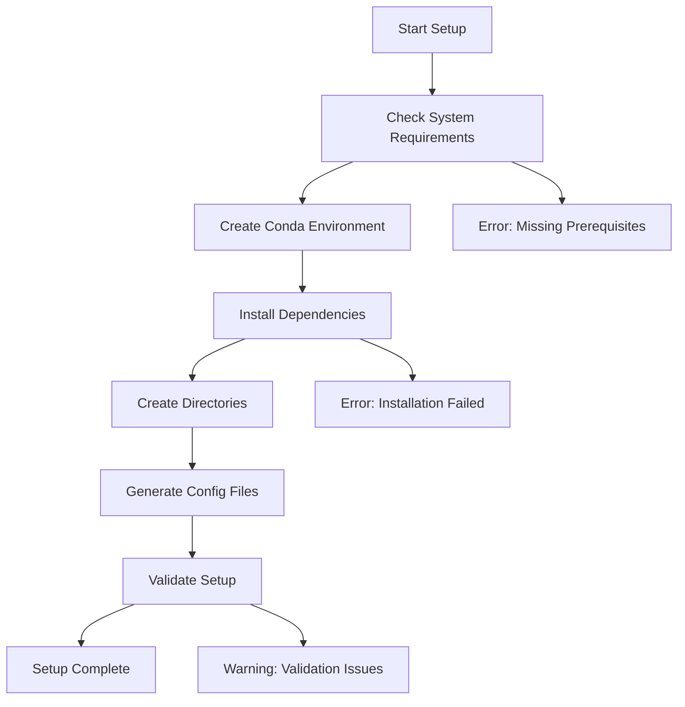

# Windows Setup Guide - Ceramic Armor ML Project

## Overview

This guide provides comprehensive instructions for setting up the Ceramic Armor ML project on Windows 11 Pro 64-bit systems. The project uses machine learning to predict mechanical and ballistic properties of ceramic armor materials.

## Table of Contents

1. [System Requirements](#system-requirements)
2. [Prerequisites Installation](#prerequisites-installation)
3. [Automated Setup](#automated-setup)
4. [Manual Setup (Alternative)](#manual-setup-alternative)
5. [Configuration](#configuration)
6. [Validation](#validation)
7. [Common Issues & Troubleshooting](#common-issues--troubleshooting)
8. [PowerShell Commands Reference](#powershell-commands-reference)
9. [Windows-Specific Considerations](#windows-specific-considerations)

## System Requirements

### Hardware Requirements
- **CPU**: Intel i7-12700K or equivalent (20 threads recommended)
- **RAM**: 32GB minimum (64GB recommended for full dataset)
- **Storage**: 50GB free space (SSD recommended)
- **GPU**: Not required (CPU-optimized implementation)

### Software Requirements
- **OS**: Windows 11 Pro 64-bit (Windows 10 compatible)
- **Python**: 3.9-3.12 (3.11 recommended)
- **Conda**: Miniconda or Anaconda
- **Git**: For version control (optional)

## Prerequisites Installation

### 1. Install Miniconda

Download and install Miniconda from the official website:

```powershell
# Download Miniconda installer
Invoke-WebRequest -Uri "https://repo.anaconda.com/miniconda/Miniconda3-latest-Windows-x86_64.exe" -OutFile "Miniconda3-installer.exe"

# Run installer (follow GUI prompts)
.\Miniconda3-installer.exe
```

**Important**: During installation, check "Add Miniconda3 to my PATH environment variable"

### 2. Install Visual Studio Build Tools (if needed)

Some Python packages require C++ compilation:

```powershell
# Download and install Visual Studio Build Tools
Invoke-WebRequest -Uri "https://aka.ms/vs/17/release/vs_buildtools.exe" -OutFile "vs_buildtools.exe"
.\vs_buildtools.exe --add Microsoft.VisualStudio.Workload.VCTools
```

### 3. Verify Installation

Open a new Command Prompt or PowerShell and verify:

```cmd
conda --version
python --version
```

## Automated Setup

### Quick Setup (Recommended)

1. **Download the project** (if not already done):
   ```cmd
   git clone <repository-url>
   cd ceramic-armor-ml
   ```

2. **Run the automated setup script**:
   ```cmd
   setup_windows.bat
   ```

The script will:
- Check system requirements
- Create conda environment `ceramic-armor-ml`
- Install all Python dependencies
- Create directory structure
- Generate configuration files
- Validate the setup

### What the Setup Script Does



## Manual Setup (Alternative)

If the automated setup fails, follow these manual steps:

### 1. Create Conda Environment

```cmd
# Create environment with Python 3.11
conda create -n ceramic-armor-ml python=3.11 -y

# Activate environment
conda activate ceramic-armor-ml
```

### 2. Install Dependencies

```cmd
# Upgrade pip
pip install --upgrade pip setuptools wheel

# Install requirements
pip install -r requirements.txt
```

### 3. Create Directory Structure

```powershell
# Create required directories
$dirs = @(
    "data\raw", "data\processed", "data\features", "data\splits",
    "results\models", "results\predictions", "results\metrics", 
    "results\figures", "results\reports", "logs"
)

foreach ($dir in $dirs) {
    if (!(Test-Path $dir)) {
        New-Item -ItemType Directory -Path $dir -Force
        Write-Host "Created: $dir"
    }
}
```

### 4. Configure API Keys

```cmd
# Copy template and edit
copy config\api_keys.yaml.example config\api_keys.yaml
notepad config\api_keys.yaml
```

## Configuration

### 1. API Keys Setup

Edit `config\api_keys.yaml`:

```yaml
# Materials Project API Key (Required)
materials_project: "your-api-key-here"

# Semantic Scholar API Key (Optional)
semantic_scholar: "your-api-key-here"
```

**Get your Materials Project API key**:
1. Visit https://materialsproject.org/api
2. Create account or log in
3. Generate API key
4. Copy to config file

### 2. Environment Variables

The setup creates a `.env` file with Intel CPU optimizations:

```bash
# Intel CPU Optimization
OMP_NUM_THREADS=20
MKL_NUM_THREADS=20
NUMEXPR_NUM_THREADS=20
OPENBLAS_NUM_THREADS=20

# Project paths
PROJECT_ROOT=C:\path\to\ceramic-armor-ml
DATA_PATH=C:\path\to\ceramic-armor-ml\data
```

### 3. Windows-Specific Configuration

For optimal performance on Windows:

```yaml
# In config/config.yaml
intel_optimization:
  enabled: true
  patch_sklearn: true
  num_threads: 20
  environment_variables:
    OMP_NUM_THREADS: "20"
    MKL_NUM_THREADS: "20"
```

## Validation

### 1. Quick Validation

Run the automated validation:

```cmd
# Activate environment
conda activate ceramic-armor-ml

# Run validation script
python scripts\00_validate_setup.py
```

### 2. Test Core Imports

```cmd
# Test critical imports
python -c "import numpy, pandas, sklearn, xgboost, catboost, shap, pymatgen; print('All imports successful')"
```

### 3. Test Intel Optimizations

```cmd
# Test Intel optimizations
python -c "from sklearnex import patch_sklearn; patch_sklearn(); print('Intel optimizations active')"
```

### 4. Run Minimal Test

```cmd
# Run minimal test pipeline (30 minutes)
python scripts\run_minimal_test.py
```

## Common Issues & Troubleshooting

### Issue 1: Conda Not Found

**Error**: `'conda' is not recognized as an internal or external command`

**Solution**:
```cmd
# Add conda to PATH manually
set PATH=%PATH%;C:\Users\%USERNAME%\miniconda3\Scripts
# Or reinstall Miniconda with PATH option checked
```

### Issue 2: Package Installation Fails

**Error**: `Microsoft Visual C++ 14.0 is required`

**Solution**:
```cmd
# Install Visual Studio Build Tools
# Download from: https://visualstudio.microsoft.com/visual-cpp-build-tools/
```

### Issue 3: Import Errors

**Error**: `ModuleNotFoundError: No module named 'src'`

**Solution**:
```cmd
# Ensure you're in the project root directory
cd C:\path\to\ceramic-armor-ml

# Check PYTHONPATH
set PYTHONPATH=%cd%\src;%PYTHONPATH%
```

### Issue 4: API Connection Issues

**Error**: `API key not found or invalid`

**Solution**:
1. Verify API key in `config\api_keys.yaml`
2. Test connectivity:
   ```cmd
   python scripts\test_api_connectivity.py
   ```

### Issue 5: Memory Issues

**Error**: `MemoryError` during training

**Solution**:
```cmd
# Reduce batch size in config
# Or increase virtual memory:
# Control Panel > System > Advanced > Performance Settings > Advanced > Virtual Memory
```

### Issue 6: Path Length Issues

**Error**: `FileNotFoundError` with long paths

**Solution**:
```cmd
# Enable long path support (requires admin)
reg add HKLM\SYSTEM\CurrentControlSet\Control\FileSystem /v LongPathsEnabled /t REG_DWORD /d 1
```

## PowerShell Commands Reference

### Environment Management

```powershell
# List conda environments
conda env list

# Activate environment
conda activate ceramic-armor-ml

# Deactivate environment
conda deactivate

# Remove environment
conda env remove -n ceramic-armor-ml
```

### Project Operations

```powershell
# Run setup validation
& python scripts\00_validate_setup.py

# Run data collection test
& python scripts\01_test_data_collectors.py

# Run minimal pipeline
& python scripts\run_minimal_test.py

# Run full pipeline
& python scripts\run_full_pipeline.py
```

### System Information

```powershell
# Check Python version
python --version

# Check installed packages
pip list

# Check system resources
Get-ComputerInfo | Select-Object TotalPhysicalMemory, CsProcessors

# Check disk space
Get-WmiObject -Class Win32_LogicalDisk | Select-Object DeviceID, Size, FreeSpace
```

### File Operations

```powershell
# Create directories
New-Item -ItemType Directory -Path "data\raw" -Force

# Copy files
Copy-Item "config\api_keys.yaml.example" "config\api_keys.yaml"

# Check file existence
Test-Path "config\api_keys.yaml"

# View file content
Get-Content "config\config.yaml" | Select-Object -First 20
```

## Windows-Specific Considerations

### 1. File Path Handling

The project uses `pathlib` for cross-platform compatibility:

```python
from pathlib import Path

# Correct way to handle paths
data_path = Path("data") / "raw" / "materials.csv"

# Avoid hardcoded separators
# Wrong: "data\raw\materials.csv"
# Right: Path("data", "raw", "materials.csv")
```

### 2. Environment Variables

Windows uses different syntax for environment variables:

```cmd
# Command Prompt
set OMP_NUM_THREADS=20
echo %OMP_NUM_THREADS%

# PowerShell
$env:OMP_NUM_THREADS = "20"
Write-Host $env:OMP_NUM_THREADS
```

### 3. Process Management

Windows handles multiprocessing differently:

```python
# Always use if __name__ == "__main__": for multiprocessing
if __name__ == "__main__":
    # Multiprocessing code here
    pass
```

### 4. Memory Management

Windows memory management considerations:

```python
# Use memory mapping for large datasets
import numpy as np
data = np.memmap('large_file.dat', dtype='float32', mode='r')

# Explicitly delete large objects
del large_dataframe
import gc
gc.collect()
```

### 5. Antivirus Considerations

Some antivirus software may interfere:

1. **Add project folder to exclusions**
2. **Whitelist Python.exe and conda.exe**
3. **Disable real-time scanning for project directory**

### 6. Windows Defender SmartScreen

If Windows blocks execution:

1. Right-click the .bat file
2. Select "Properties"
3. Check "Unblock" if present
4. Click "OK"

## Performance Optimization

### 1. Intel CPU Optimization

The project includes Intel optimizations for i7-12700K:

```python
# Automatically applied in the project
from sklearnex import patch_sklearn
patch_sklearn()
```

### 2. Thread Configuration

Optimal thread settings for i7-12700K (20 threads):

```bash
OMP_NUM_THREADS=20
MKL_NUM_THREADS=20
NUMEXPR_NUM_THREADS=20
```

### 3. Memory Settings

For 32GB RAM systems:

```yaml
# In config/config.yaml
training:
  batch_size: 1000
  n_jobs: 20
  memory_limit: "24GB"
```

## Getting Help

### 1. Check Logs

```cmd
# View setup logs
type logs\setup_validation_report.txt

# View application logs
type logs\ceramic_armor_ml.log
```

### 2. Run Diagnostics

```cmd
# Run comprehensive diagnostics
python scripts\verify_setup.py
```

### 3. Common Commands

```cmd
# Quick environment check
conda info --envs

# Package versions
pip show xgboost catboost scikit-learn

# System information
systeminfo | findstr /C:"Total Physical Memory"
```

## Next Steps

After successful setup:

1. **Configure API keys** in `config\api_keys.yaml`
2. **Run validation**: `quick_test.bat`
3. **Test pipeline**: `run_minimal_test.bat`
4. **Review documentation** in `docs\` folder
5. **Start with minimal dataset** before full-scale runs

For advanced usage, see:
- `docs\api_reference.rst` - API documentation
- `docs\quickstart.rst` - Quick start guide
- `scripts\README_minimal_test.md` - Testing guide